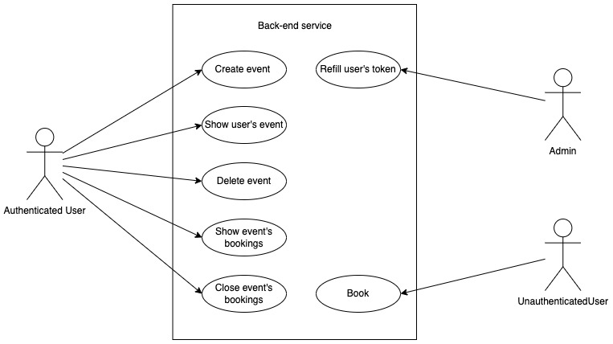
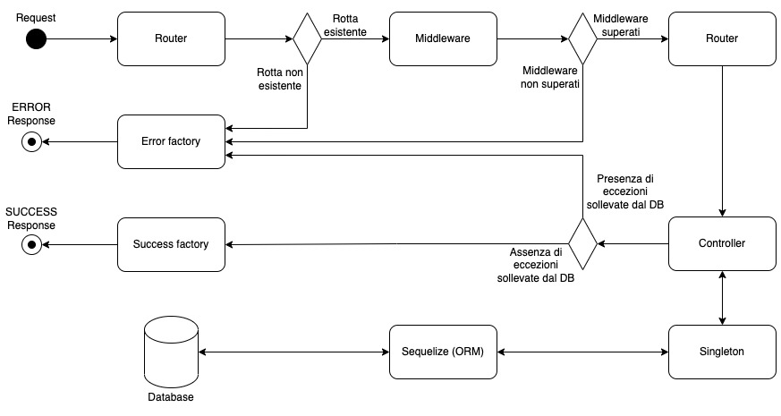
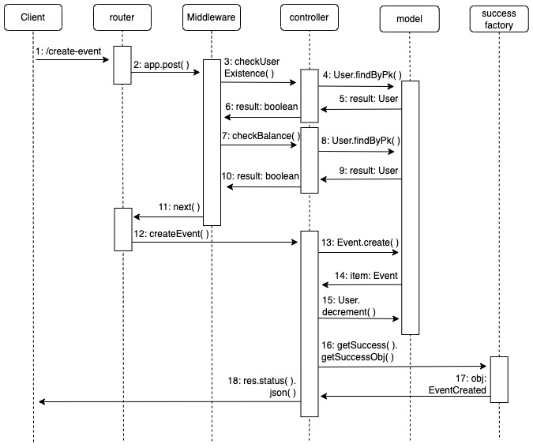
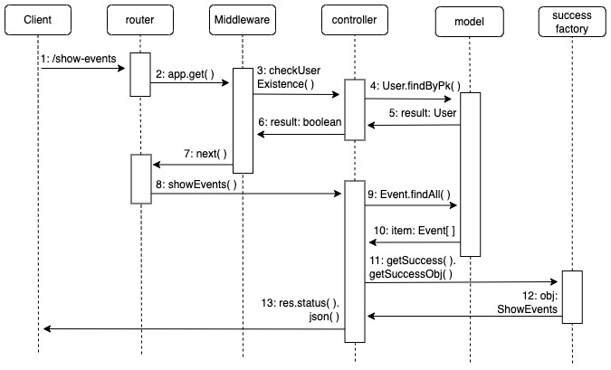
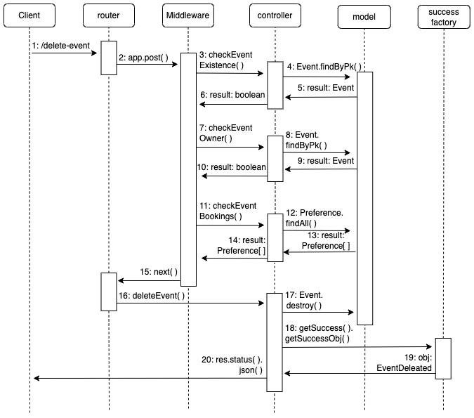
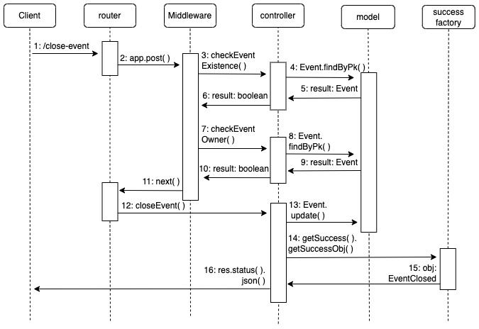
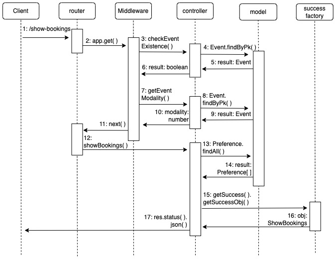
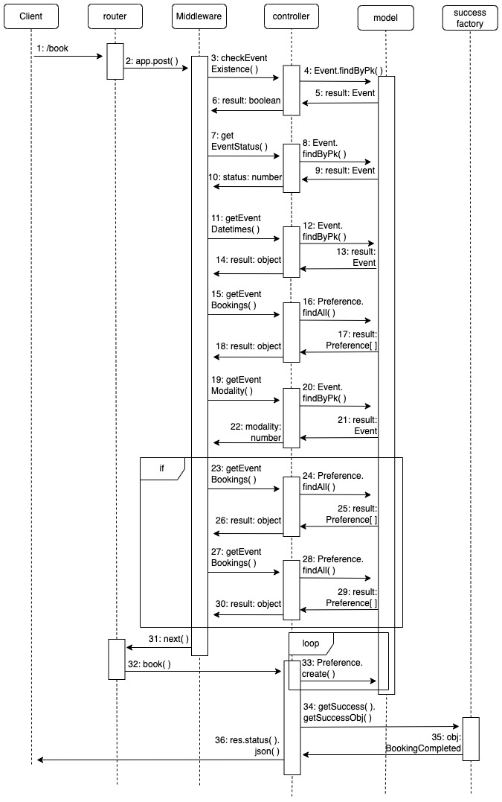
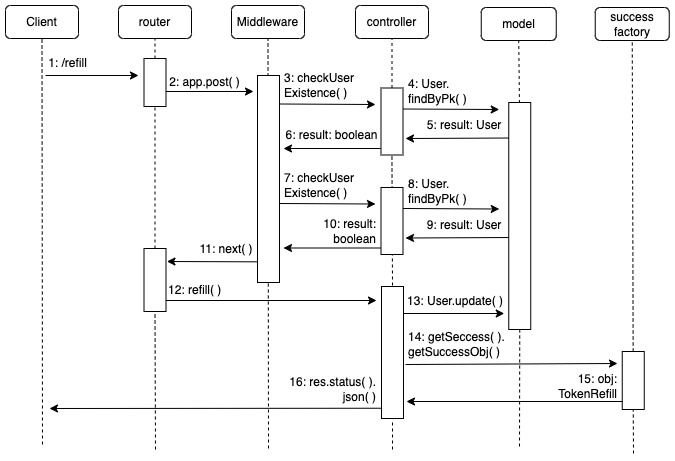

# Progetto Programmazione Avanzata 2022 - Angelini, Di Silvestre

## Obiettivo del progetto
Il servizio back-end realizzato consente agli utenti di effettuare prenotazioni di slot temporali associati ad eventi di vario genere. In particolare, il sistema permette di effettuare chiamate per:
* Creare un nuovo evento
* Restituire la lista degli eventi associati all’utente
*	Cancellare un evento se non è stata inserita alcuna preferenza
* Chiudere un evento, ovvero non consentire più alcuna votazione
* Restituire le prenotazioni associate all’evento
* Consentire ad un utente di effettuare le prenotazioni
* Permettere ad un utente admin di ricaricare il credito di un utente (utilizzato per creare eventi)

Ogni azione corrisponde a una differente richiesta HTTP (GET o POST) che deve essere, o meno, autenticata tramite token [JWT](http://jwtbuilder.jamiekurtz.com/).

Il client si intefraccerà con il servizio tramite un API testing (ad esempio Postman o cURL) che sarà in ascolto sulla porta 8080 di un webserver generato da Docker, il quale comporrà due container, rispettivamente eseguiti a partire da un'immagine Node.js e da un'immagine MySQL.

## Dettagli delle richieste
La seguente tabella mostra le richieste possibili:

|    TIPO        |ROTTA                          |TOKEN JWT     |
|----------------|-------------------------------|--------------|
|POST            |/create-event                  |SI|
|GET             |/show-events                   |SI|
|POST            |/delete-event                  |SI|
|POST            |/close-event                   |SI|
|GET             |/show-bookings                 |SI|
|POST            |/book                          |NO|
|POST            |/refill                        |SI|
 

### Creare un evento (create-event)
Tramite questa richiesta è possibile creare un nuovo evento.
~~~
Da effettuare tramite token JWT che deve contenere un payload JSON con la seguente struttura:
{
  "title": "Riunione di Reparto",
  "owner": "giordano@email.com",
  "datetimes": [
    "2022-06-11T15:00:00+01:00",
    "2022-06-18T15:00:00+01:00",
    "2022-06-25T15:00:00+01:00"
  ],
  "modality": 1,
  "latitude": 43.6174457,
  "longitude": 13.4789451,
  "link": "https://meet.google.com",
  "sender_role": "user",
  "sender_id": "giordano@email.com"
}

* Le coordinate e il link possono essere omessi o avere valore 'null'
~~~

La modalità di un evento può assumere valore:
* 1: Nessuna restrizione sulla prenotazione (tutti possono prenotare qualsiasi slot); serve per trovare la soluzione più “gettonata”
* 2: Vincolare ad ogni slot una sola preferenza; serve per limitare che più utenti possano prenotare lo stesso slot
* 3: Vincolare per un utente un singolo slot (evitare che un utente possa occupare più slot)

### Mostrare eventi (show-events)
Tramite questa richiesta è possibile ottenere la lista di eventi organizzati da uno specifico utente suddivisi per attivi (iscrizioni aperte) e inattivi (iscrizioni chiuse).
~~~
Da effettuare tramite token JWT che deve contenere un payload JSON con la seguente struttura:
{
  "owner": "giordano@email.com",
  "sender_role": "user",
  "sender_id": "giordano@email.com"
}
~~~

### Cancellare eventi (delete-event)
Tramite questa richiesta è possibile cancellare un evento per il quale non sia stata ancora espressa alcuna preferenza.
~~~
Da effettuare tramite token JWT che deve contenere un payload JSON con la seguente struttura:
{
  "event_id": 4,
  "sender_role": "user",
  "sender_id": "giordano@email.com"
}
~~~

### Chiudere eventi (close-event)
Tramite questa richiesta è possibile chiudere un evento, ovvero non permettere ulteriori prenotazioni.
~~~
Da effettuare tramite token JWT che deve contenere un payload JSON con la seguente struttura:
{
  "event_id": 5,
  "sender_role": "user",
  "sender_id": "giordano@email.com"
}
~~~

### Mostrare preferenze (show-bookings)
Tramite questa richiesta è possibile ottenere la lista delle prenotazioni associate a un dato evento, nel caso trattasi di un evento con modalità 1 ('nessuna restrizione') viene ritornata la lista delle N soluzioni più gettonate, con N impostabile dall’utente (N = 10 se non specificato).
~~~
Da effettuare tramite token JWT che deve contenere un payload JSON con la seguente struttura:
{
  "event_id": 1,
  "limit": 3,
  "sender_role": "user",
  "sender_id": "giordano@email.com"
}

* Il limite può essere omesso o avere valore 'null', viene ignorato se trattasi di un evento con modalità diversa da 1
~~~

### Effettuare una prenotazione (book)
Tramite questa richiesta è possibile esprimere una preferenza per un determinato evento (secondo le [condizioni](#modality) citate precedentemente).
~~~
Da effettuare richiesta HTTP con Content-Type:'application/json' nell'header e payload JSON con la seguente struttura:
{
  "event_id": 3,
  "datetimes": [
     "2022-06-15T09:30:00+01:00"
  ],
  "email":"pippo@email.com",
  "name": "Pippo",
  "surname": "Rossi"
}
~~~

### Ricaricare token di un utente (refill)
Tramite questa richiesta è possibile (per un utente admin) ricaricare il credito di un utente specificandone l'email assieme alla quantità di token da sovrascrivere a quella corrente.
~~~
Da effettuare tramite token JWT che deve contenere un payload JSON con la seguente struttura:
{
  "owner": "giordano@email.com",
  "token": 15,
  "sender_id": "antonio@email.com",
  "sender_role": "admin"
}
~~~

## Progettazione - UML
Di seguito vengono riportati i diagrammi UML:
* Use Case Diagram
* Interaction Overview Diagram
* Sequence Diagram 

### Use Case Diagram

### Interaction Overview Diagram

### Sequence Diagram
* **Chiamata POST /create-event :**

* **Chiamata GET /show-events :**

* **Chiamata POST /delete-event :**

* **Chiamata POST /close-event :**

* **Chiamata GET /show-bookings :**

* **Chiamata POST /book :**

* **Chiamata POST /refill :**

## Progettazione - Pattern

### Singleton
Il Singleton fa parte dei Creational Design Pattern e assicura che una classe abbia una singola istanza accessibile globalmente.\
Tale pattern è stato utilizzato per instaurare una connessione con il database così da avere la certezza di lavorare sulle medesime istanze dello stesso.\
Nel dettaglio, il Singleton è implementato nel file [sequelize.ts](typescript/singleton/sequelize.ts).

### Factory 
La Factory fa parte dei Creational Design Pattern e fornisce un'interfaccia per la creazione di oggetti i quali possono essere alterati dalle classi che implementano la stessa.\
Tale pattern è stato utilizzato per la creazione di oggetti che descrivono errori o successi del servizio, essendo questi ultimi accumunati dalla medesima struttura (status code e messaggio da ritornare nella risposta HTTP).\
Nel dettaglio, la Factory è implementata in [factory](typescript/factory).

### Chain of Responsibility (CoR) 
La CoR fa parte dei Behavioural Design Pattern e permette di processare una richiesta attraverso l'esecuzione di funzioni collegate tra loro in un determinato ordine. In Express, la CoR è realizzata tramite le funzionalità dei middleware i quali rappresentano i veri e propri anelli della catena.\
Tale pattern è stato utilizzato per filtrare le richieste HTTP in modo da far pervenire al Controller solamente quelle corrette; per ogni rotta è stata definita una catena di middleware composta da:
* middleware per il controllo dell'header e del token JWT (ove necessario);
* middleware specifici della rotta (controllo sui tipi, sull'integrità dei dati, sui vincoli del database...);
* middleware per la gestione degli errori, che prendono in carico le eccezioni sollevate dagli anelli precedenti e generano oggetti tramite la [Factory](#factory).

Nel dettaglio, la CoR è implementata in [middleware](typescript/middleware).

## Avvio del servizio
Prerequisiti:
* Ambiente Docker installato sulla propria macchina

Procedura di avvio:
* Posizionarsi nella cartella clonata dal seguente repository
* Eseguire il seguente comando: (sostituire 'mysupersecretkey' con la chiave con la quale verranno generati i token JWT)
~~~
$ echo 'KEY=mysupersecretkey' >> .env
~~~
* Avviare il servizio Docker tramite il comando:
~~~
$ docker-compose up
~~~
* Eseguire le richieste sulla porta 8080 tramite cURL o Postman

## Test del progetto

É possibile eseguire una serie di test predefiniti importando all'interno di Postman la collection [(postman_collection.json)](postman_collection.json) situata all'interno della root directory di tale repository. Tutti i token JWT sono stati generati tramite la chiave 'mysupersecretkey'.

## Note

### Software utilizzati
* [Visual Studio Code](https://code.visualstudio.com/) - IDE
* [Docker](https://www.docker.com/) - Gestore di container
* [Postman](https://www.postman.com/) - API Testing Platform

### Autori
* Giordano Angelini: [Github](https://github.com/giordanoangelini)
* Cristian Di Silvestre: [Github](https://github.com/DiSilvestreCristian)
